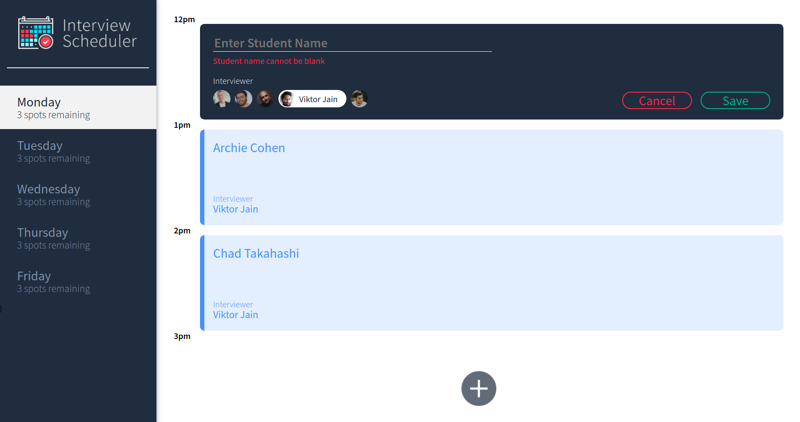
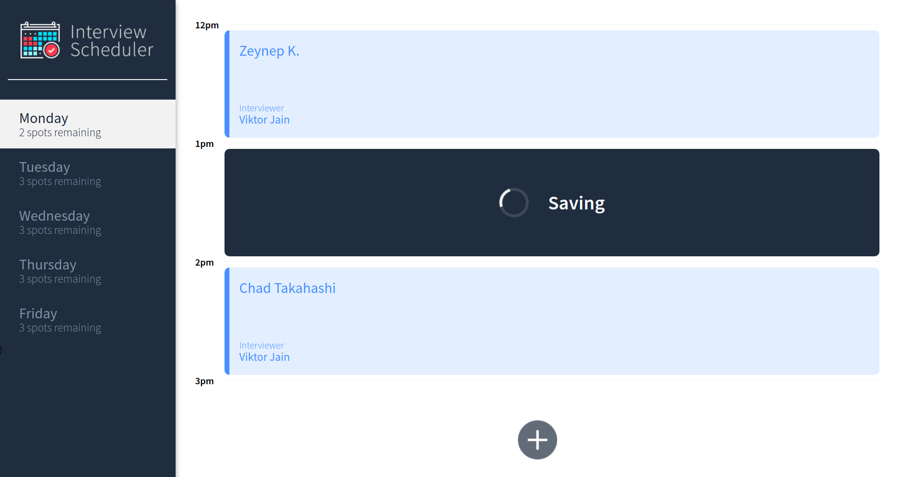
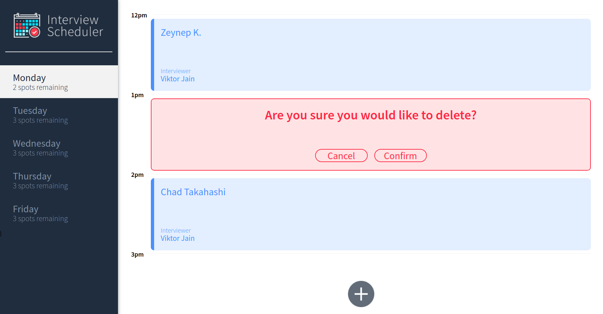
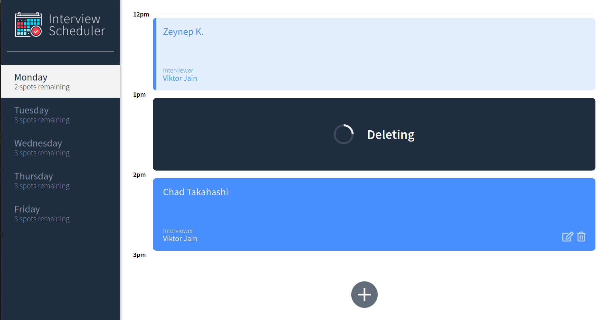
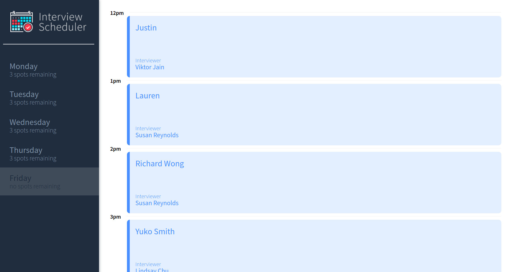

# Interview Scheduler

## Project Description
Using the latest tools and techniques, we build and test a React application that allows users to book and cancel interviews. We combine a concise API with a WebSocket server to build a realtime experience.

## About Features
- Appointment days (Monday to Friday) are displayed depending on availability
- The days show the number of slots available for the day.
- Users can switch between days and find details about the interviews they can have.
- A user can book interviews by typing in a student name and clicking on an interviewer.
- A user can edit the details of an existing interview they created.
- A user can also cancel an existing interview.
- Days display currently remaining spots and capture updates after each spot changes.

## Setup

Install dependencies with `npm install`.

## Running Webpack Development Server

```sh
npm start
```

## Running Jest Test Framework

```sh
npm test
```

## Running Storybook Visual Testbed

```sh
npm run storybook
```
## Student can't book an appointment without entering a name.


## Booking an appointment.


## Saving an appointment.


## Confirmation before deleting an appointment.


## Deleting an appointment.


## No spots remaining for the day.



