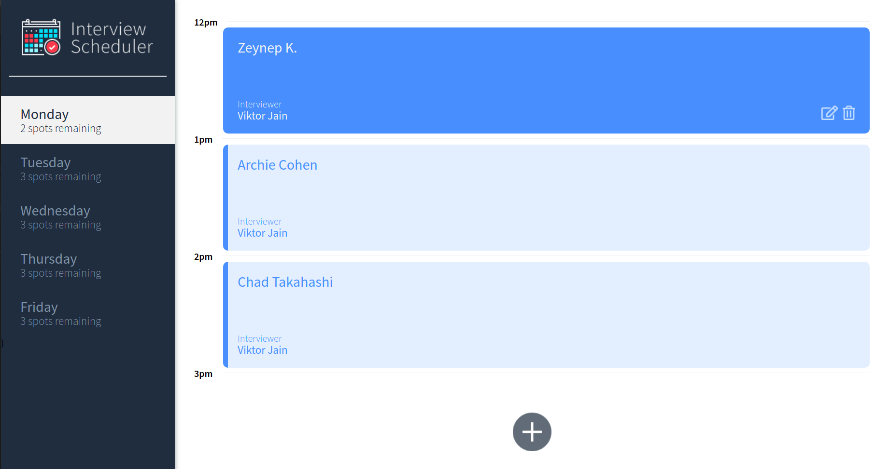

# Interview Scheduler

## Project Description
Using the latest tools and techniques, we build and test a React application that allows users to book and cancel interviews. We combine a concise API with a WebSocket server to build a realtime experience.

## About Features
- Appointment days (Monday to Friday) are displayed depending on availability
- The days show the number of slots available for the day.
- Users can switch between days and find details about the interviews they can have.
- A user can book interviews by typing in a student name and clicking on an interviewer.
- A user can edit the details of an existing interview they created.
- A user can also cancel an existing interview.
- Days display currently remaining spots and capture updates after each spot changes.

## Scheduler-api 

Scheduler api server is a second server responsible for providing data. We can make HTTP requests to the server to retrieve and alter appointment data. The API is limited to support the minimal requirements for the application.

## Setup

Install dependencies with `npm install`.

## List Of Dependencies
```
axios: "^0.25.0",
classnames: "^2.2.6",
normalize.css: "^8.0.1",
react: "^16.9.0",
react-dom: "^16.9.0",
react-scripts: "3.0.0"
```

## List of DevDependencies
```
@babel/core: "^7.4.3",
@storybook/addon-actions: "^5.0.10",
@storybook/addon-backgrounds: "^5.0.10",
@storybook/addon-links: "^5.0.10",
@storybook/addons: "^5.0.10",
@storybook/react: "^5.0.10",
@testing-library/jest-dom: "^4.0.0",
@testing-library/react: "^8.0.7",
@testing-library/react-hooks: "^7.0.2",
babel-loader: "^8.0.5",
node-sass: "^4.14.0",
prop-types: "^15.8.1",
react-test-renderer: "^16.9.0"
```
## Running Webpack Development Server

```sh
npm start
```

## Running Jest Test Framework

```sh
npm test
```

## Running Storybook Visual Testbed

```sh
npm run storybook
```
## Student can't book an appointment without entering a name.


## Booking an appointment.


## Saving an appointment.


## Confirmation before deleting an appointment.


## Deleting an appointment.


## No spots remaining for the day.


